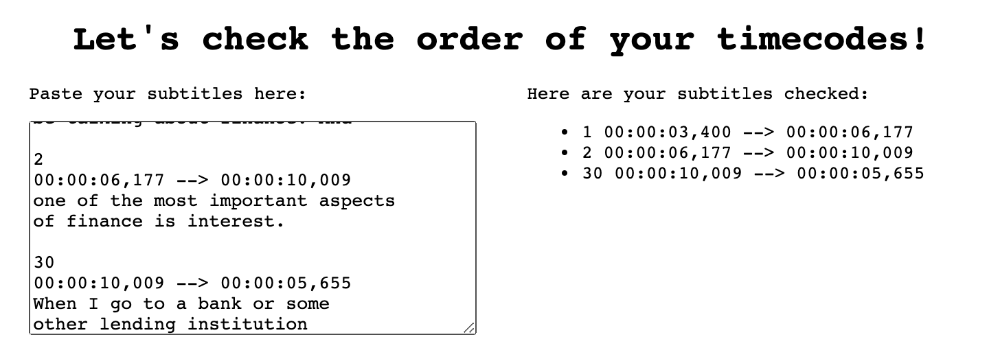
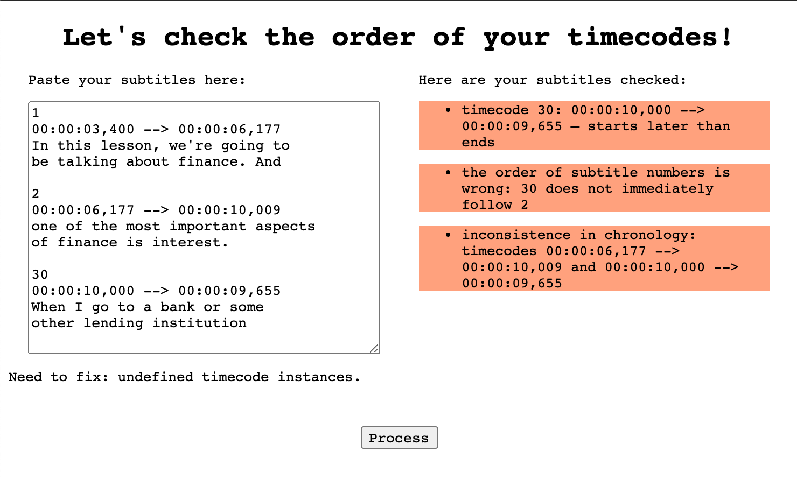
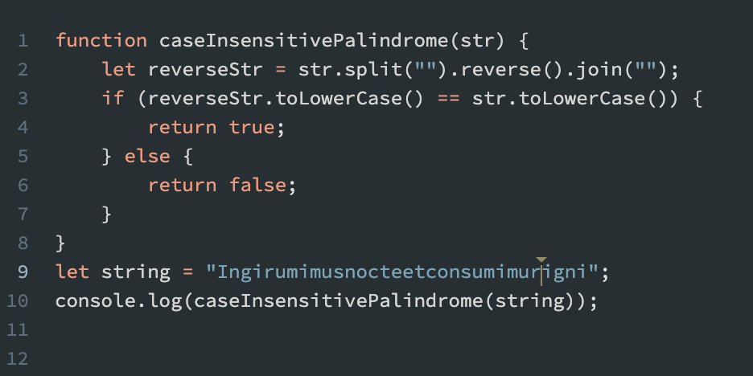
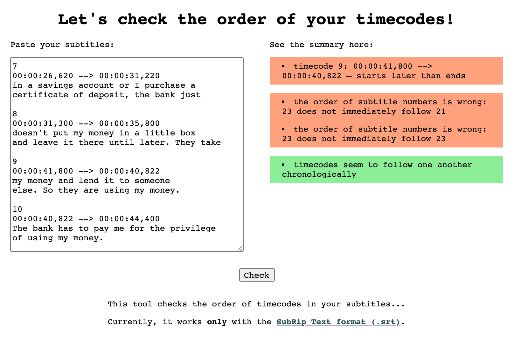
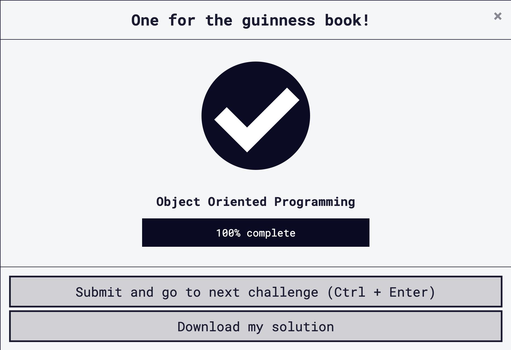

# 100 Days Of Code - Log

## Day 1: June 1, 2020

**Today's Progress:** Set up the 100 Days of Code Repo, added the README file to the Raptors of Berlin project.

**Thoughts:** I started the challenge to mainly spend more time working on actual projects (which I tend to start and never finish). Although I'm still not sure if small things like creating README files count as coding, they surely do take time.

**Link to work:** [Raptors of Berlin](https://github.com/olhanotolga/raptors_of_berlin) (repo on GitHub)

**On Twitter:** [Public commitment](https://twitter.com/Ajnochka/status/1267488609873145864)

## Day 2: June 2, 2020

**Today's Progress:** Spent some time refactoring my freeCodeCamp Responsive Design projects, e.g. made the navigation menu expansible and collapsible under the certain screen width. (Added an event listener to multiple elements using a for loop.)

**Thoughts:** Need to practice more manipulating DOM with JavaScript. At the moment, it takes a long long time...

**Link to work:** [Tech Documentation with JS Dropdown](https://codepen.io/olhanotolga/full/WNrNbZz)

## Day 3: June 3, 2020

**Today's Progress:** Continued DOM manipulation with JS. Watched The Web Developer Bootcamp course on Udemy and tried out some things I was curious about. This time, I was either coding ahead of the lesson or doing something different than what's in the videos.

**Thoughts:** I need to learn to think more about the logic as well as overall structure. Exercising patience (and also learning) will help me come up with more complex solutions.

**Link to work:** [Basic to-do list with tooltips](https://codepen.io/olhanotolga/full/qBbBgPR)

## Day 4: June 4, 2020

**Today's Progress:** Spend several hours polishing one of my projects — a knowledge base for subtitlers working for the Molodist Film Festival (Kyiv, Ukraine). The project itself is built with Flask, which renders Jinja-enclosed Bootstrap-powered HTML templates. I mostly worked with text and styles, converting everything into Ukrainian and finalizing the readme file for the GitHub repo page. I also re-deployed it to Python Anywhere, so that it's up to date.

**Thoughts:** It's increadible how I managed to forget so much of what I was actively doing a few months ago! On the other hand, I now have a better understanding of what I'm doing (wrong), why, and how to fix it :)

**Link to work:** [Molodist Subtitlers (GitHub repo)](https://github.com/olhanotolga/molodist-subtitlers)

## Day 5: June 5, 2020

**Today's Progress:** I finally started learning Regex on freeCodeCamp because I want to later apply it in my project, which is a knowledge base for film festival translators. Alongside the fCC exercises, I put together a pen where I check user input with a simple regex (a set of words separated by the alternation operator) and output if she/he is a hipster or not. It was also more DOM practice.

**Thoughts:** My current use case of regex is primitive. Still, I had fun :)

**Link to work:** [Are you a hipster? (CodePen)](https://codepen.io/olhanotolga/full/ZEQYqKN)

## Day 6: June 6, 2020

**Today's Progress:** Did not have much time, so I continued learning regex on freeCodeCamp. Got stuck on the challenge (Restrict Possible Usernames), had to look up the possible solution.

**Thoughts:** I feel weird because my solution to the fCC challenge looks way more complicated than it seems it should be...

**Link to work:** [my freeCodeCamp profile](https://www.freecodecamp.org/olhanotolga)

## Day 7: June 7, 2020

**Today's Progress:** Went through a few more regex exercises on freeCodeCamp. Refactored yesterday's username-checking challenge and put together another pen that checks if input contains multiple spaces in a row.

**Thoughts:** It gets more interesting with regex. Will definitely look for more resources on this later.

**Link to work:** [Finding redundant spaces: CodePen](https://codepen.io/olhanotolga/full/xxZGeLJ)

## Day 8: June 8, 2020

**Today's Progress:** Done the rest of the regex exercises on freeCodeCamp. Upgraded yesterday's tool to not just find multiple spaces in a row but remove redundant spaces (also before commas, periods etc.).

**Thoughts:** Regex is both fun and frustrating. "Back in the day" I thought making a redundant space remover would be super simple. It kind of is ...not.

**Link to work:** [Removing redundant spaces: CodePen](https://codepen.io/olhanotolga/full/xxZGeLJ)

## Day 9: June 9, 2020

**Today's Progress:** Created the layout for a JS calculator (a current project with FrauenLoop), done the debugging exercises on freeCodeCamp, and coded along a JS-based color guessing game. Will be debugging the latter tomorrow.

**Thoughts:** Had fun coding along a game but found it a bit frustrating that I didn't have (allow myself) the time to think ahead. Also frustrating that my H1 background color does not reset to the initial one!

**Link to work:** [JS Calculator (repo)](https://github.com/olhanotolga/js-calculator)

## Day 10: June 10, 2020

**Today's Progress:** Did exercises on freeCodeCamp (data structures), learned a bit of bash scripting, and played around with the look and feel of the color game. Fixed the issue with the h1 — "steelblue" turned out to be an invalid color name for JS.

**Thoughts:** Learned something, did something fun. Not a bad day :)

**Link to work:** [Color guessing game](https://codepen.io/olhanotolga/full/poggQQX)

## Day 11: June 11, 2020

**Today's Progress:** Finally created aliases for the paths to my most frequently worked in directories! After spending some time on bash exercises, I switched back to the color game. Managed to change the styling a bit more and added an expansible & collapsible rules block.

**Thoughts:** I have a feeling that I'll spend some time on customizing that color game.

**Link to work:** [Color guessing game](https://codepen.io/olhanotolga/full/poggQQX)

## Day 12: June 12, 2020

**Today's Progress:** Spend a few hours doing Basic Data Structures exercises on freeCodeCamp. Not without a struggle.

**Thoughts:** I feel that it's enough for today.

**Link to work:** [My freeCodeCamp profile](https://www.freecodecamp.org/olhanotolga)

## Day 13: June 13, 2020

**Today's Progress:** Watched the Udemy Web Dev course, the sections on jQuery. Played around with it a bit. Nothing serious.

**Thoughts:** I keep hearing that it's not worth learning jQuery. Still, I'd stumbled upon so much of it when looking up JS-related things that knowing it does more good than harm.

**Link to work:** [a silly pen](https://codepen.io/olhanotolga/full/YzwWQNy)

## Day 14: June 14, 2020

**Today's Progress:** Watched the MIT lecture on Data Wrangling, tried a few things on the command line. Did a few challenges on SoloLearn.

**Thoughts:** Thinking about a regex project I'm about to start (mostly about how to approach it), also about primitive data types in JS and how tricky they can be.

**Link to work:** [link on the MIT lecture](https://missing.csail.mit.edu/2020/data-wrangling/), [my SoloLearn profile](https://www.sololearn.com/Profile/17065020/)

## Day 15: June 15, 2020

**Today's Progress:** Practiced constructing quick regex patterns with [RegexOne](https://regexone.com/), then coded the JS calculator during today's FrauenLoop class. Aside from JS-related stuff, learned about the value and type attributes within the button element.

**Thoughts:** Although a calculator is considered to be beginner-friendly and super basic, it takes quite some time for a new to grasp it. Lots of 'oh wow!' moments.

**Link to work:** [JS calculator](https://github.com/olhanotolga/js-calculator)

## Day 16: June 16, 2020

**Today's Progress:** A friend of mine suggested that I contribute to his project, for which I need to know the basics of Vue.js. So, really, all I did is watched the Vue.js tutorial and played around with my first primitive app.

**Thoughts:** Lots of excitement about the upcoming project, as well as lots of frustration because of going back to watching tutorials.

**Link to work:** [Link to the intro to Vue.js on Vue Mastery](https://www.vuemastery.com/courses/intro-to-vue-js/components)

## Day 17: June 17, 2020

**Today's Progress:** Continued the Vue.js tutorial from yesterday, tried to understand how components are interconnected with each other and with my HTML document (it turned out I should have left the latter alone).

**Thoughts:** I was frustrated because I couldn't seem to understand Vue's basic concepts (until I found out that you nest components within templates of parental components...). I swear I'll do something better yesterday!

**Link to work:** [Link to the intro Vue.js course, once again](https://www.vuemastery.com/courses/intro-to-vue-js/components)

## Day 18: June 18, 2020

**Today's Progress:** Finished the Vue.js tutorial from yesterday, still trying to understand the relationship between components and continuing to build my 'hello-world' app.

**Thoughts:** This will take quite some time...

**Link to work:** [Link to the intro Vue.js course, once again](https://www.vuemastery.com/courses/intro-to-vue-js/components) (keeping my hello-world app locally atm)

## Day 19: June 19, 2020

**Today's Progress:** More Vue.js today — this time with Scrimba & documentation. Playing around with my app, managed to transfer certain blocks of code (together with all their functionality, of course) into separate components. Outlined my next regex tool (for checking the order of timecodes in subtitles). Solved a simple coding problem on SoloLearn.

**Thoughts:** Vue.js is still very frustrating but getting interesting. I should start with less code and relations' diagrams next time.

**Link to work:** [Remove spaces from a string challenge](https://codepen.io/olhanotolga/full/JjGEeqw)

## Day 20: June 20, 2020

**Today's Progress:** Troubleshooting my hello-world Vue.js app. Couldn't figure out why reviews weren't displaying once I submitted them. Turned out the mounted function responsible for this was lost among the methods (while it should have been a method of its own within the Vue component).

**Thoughts:** I've got too much code for a start, ugly reviews form, and the app itself makes little sense... :)

**Link to work:** [Screenshot on Twitter](https://twitter.com/Ajnochka/status/1274471569147015175)

## Day 21: June 21, 2020

**Today's Progress:** Did some styling (and also conditional class-binding) of my hello-world Vue.js app. The reviews section looks much much better and makes more sense, at least visually.

**Thoughts:** Decided to take a break today from trying to learn everything and also from scolding myself for not having accomplished greatness and ultimate wisdom.

**Link to work:** [Screenshot on Twitter](https://twitter.com/Ajnochka/status/1274818924874477569)

## Day 22: June 22, 2020

**Today's Progress:** Continued working on the JS calculator. During the FrauenLoop session, refactored a few functions and practiced unit testing with jest. Then added functionality to operate multiple-digit numbers and display them on the calculator screen. Woohoo! Still missing some important calculator functionality but the main chunk is done.

**Thoughts:** Thought that I'm juggling too many projects at once.

**Link to work:** [JS Calculator](https://olhanotolga.github.io/js-calculator/index.html)

## Day 23: June 23, 2020

**Today's Progress:** More work on my JS calculator, crossing the first 3 items off the following to-do list:

- enable the +/- (sign changing) button
- enable the , (floating point) button
- enable the % (percentage) button
- add and enable the ^ (square root) button
- rearrange the buttons in a more efficient way
- add an easter egg animation
- enable operations with the result (i.e. not reset upon pressing "=")

There were also drawbacks.

For example, there are several issues with floats:

1. you can't use the floating point in a number twice
2. zero character after the floating point should be concatenated (not evaluated)

And another issue with +/-: you can't currently use it twice in the very beginning, before the input is set. Reason: the program is trying to evaluate "--" as a Number. Will fix later.

**Thoughts:** I'm going nice and slow today.

**Link to work:** [JS Calculator](https://olhanotolga.github.io/js-calculator/index.html)

## Day 24: June 24, 2020

**Today's Progress:** Solved problems from the Basic Algorithm Scripting section on freeCodeCamp. Learned and used a bunch of array and string methods I didn't know about.

**Thoughts:** Was really exciting to solve these problems. It's awesome there are tests that serve as hints to solutions. In reality, I need to start thinking about things like use cases on my own.

**Link to work:** [my freeCodeCamp profile](https://www.freecodecamp.org/olhanotolga)

## Day 25: June 25, 2020

**Today's Progress:** Tidying up my JS calculator.

Made sure that:

- one can't create numbers with more than 1 floating point
- one can't add a floating point after having turned input into percent. so, clicking '%' checks if input < 1. if yes, can't use ','
- 0.20 is a valid number and inputs like 0.30303 are possible (fixed by converting inputs to numbers at calculation, not before)
- once "+/-" is clicked before input is set, "-" is displayed. upon the 2nd click on "+/-", "-" is replaced with 0
- -0 and similar should be replaced with 0. for now, I'm updating the display once operator is set
- because of a confusion with truthy & falsy values, I managed to replace input1 with input2 if input1 was equal to 0. fixed by changing the condition from (!input1) to (input1 == undefined)

Also, implemented animation which activates once you divide by zero. Will work on its improvement (e.g. separation of concerns) later.

Remaining issues:

- remove zeroes from the beginning of the input string except a single zero that precedes "."
- remove zeroes from the end of the result number if result is a float (!Number.isInteger(result))

...

**Thoughts:** Wow, a day of breaking and making things!

**Link to work:** [JS Calculator](https://olhanotolga.github.io/js-calculator/index.html)

## Day 26: June 26, 2020

**Today's Progress:** Not much: spotted an issue with the JS calculator on mobile (Safari) — the digit buttons were displayed with a dark background. It was alright on desktop (although Safari displayed them a bit differently) and on mobile Chrome. The isuue resolved aftre I explicitly added a CSS rule for the digit buttons' background-color property.

Apart from that, I separated concerns in my JS animation (division by zero). Instead of changing styles of elements, I added classes (predefined with CSS).

**Thoughts:** I should probably test things more :)

**Link to work:** [JS Calculator](https://olhanotolga.github.io/js-calculator/index.html)

## Day 27-28: June 27-28, 2020

**Today's Progress:** Two days in one: had a physically active weekend, so didn't code much. Did a challenge on SoloLearn, started the 10 daily JS challenges on Scrimba.com, did the first one.

However, I still managed to make opeartions with results possible in my JS calculator. Now it feels more like a proper calculator app. A lot of refactoring needs to be done.

**Thoughts:** Feel bad about not doing much this weekend, especially considering that my year-long course starts tomorrow (which means I'll have much less time on my projects). On the other hand, it's nice to be able to take a rest once in a while.

**Link to work:** [JS Calculator](https://olhanotolga.github.io/js-calculator/index.html)

## Day 29: June 29, 2020

**Today's Progress:** Started learning React, as it's part of our FrauenLoop program. Got stuck in the beginning when setting up my project. Turned out I had webpack installed as a node module in my home directory, which conflicted with dependencies in my project.

This time, I'm learning by refactoring my current project, the calculator app, and rewriting it from vanilla JS to React. Realized that I really need to do a major cleanup before continuing.

Also, solved a challenge on Scrimba.

**Thoughts:** I want more time, or, probably, better prioritizing.

**Link to work:** really, nothing to show today.

## Day 30: June 30, 2020

**Today's Progress:** Practiced CLI file system navigation commands, solved a JS challenge on Scrimba, started OOP on freeCodeCamp, and — finally — started working on my Timecode Checker! I think I'm getting somewhere little by little.

**Thoughts:** Prioritizing worked, now need to stick to it :)

**Link to work:** 

## Day 31: July 1, 2020

**Today's Progress:** Practiced more CLI/Bash file system navigation, learned Markdown in class, solved another JS challenge on Scrimba, and did the draft version of the Timecode Checker! Woohoo! The great cleanup is coming.

**Thoughts:** Will be super awesome if I finish the Timecode Checker and deploy it together with Space Remover this week!

**Link to work:** 

## Day 32: July 2, 2020

**Today's Progress:** Today's theme was package managers — that's how I finally learned what Homebrew was. I think I even helped a classmate (who also uses macOS, not Ubuntu). Installed Zsh, will try it out at some point later.

Solved a challenge on Scrimba — a primitive palindrome checker.

Can't do more.

**Thoughts:** Hopefully, I'll get to real coding tomorrow.

**Link to work:** 

## Day 33: July 3, 2020

**Today's Progress:** Solved a challenge on Scrimba — was to suggest 3 ways to write a function that wraps a pair of parentheses around a string. I used basic concatenation, a string concat() method, and an array join() method.

Did a few challenges on freeCodeCamp (Object-oriented JavaScript).

**Thoughts:** No working on projects today. Now I really hope to change it tomorrow :)

**Link to work:** [my freeCodeCamp profile](https://www.freecodecamp.org/olhanotolga)

## Day 34: July 4, 2020

**Today's Progress:** Solved a CSS and JS challenge on Scrimba — this [https://scrimba.com/c/ce9zL7Hp]
and this one [https://scrimba.com/c/cMZJkVT9], respectively. Did a few challenges on freeCodeCamp (Object-oriented JavaScript). Broke my brain a little bit on the prototype chains...

**Thoughts:** "Because a prototype is an object, a prototype can have its own prototype!" has definitely made my day (and probably changed my life).

**Link to work:** [my freeCodeCamp profile](https://www.freecodecamp.org/olhanotolga)

## Day 35: July 5, 2020

**Today's Progress:** Worked a bit on my timecode checker. Tidied up the style and functionality. Tried to refactor the functions but I'm bumping into some scope issues, which I'll need to explore separately.

**Thoughts:** Now, what's left is deploy!

**Link to work:** 

## Day 36: July 6, 2020

**Today's Progress:** Refactoring my calculator apps: modifying functions in the JS calculator, so that multiple operations can be done without resetting; rewriting the React calculator — learning about function components and class components.

**Thoughts:** I think I'm getting confused with the logic: need to sit down and think the functionality through.

**Link to work:** [JS Calculator](https://olhanotolga.github.io/js-calculator/)

## Day 37: July 7, 2020

**Today's Progress:** Solved the [last challenge on Scrimba](https://scrimba.com/c/cMZmreUP) and moved on to my projects: pushed the two regex tools for film subtitlers to GitHub linking to them in a newly created index page. Looks OK for now.

Learned about .gitignore. Turns out, it only prevents specified files from being added in the future; to untrack them, they need to be explicitly removed with:

```bash
git rm --cached <file>
git rm -r --cached <folder>
```

**Thoughts:** It's so exciting to actually have made something that I will soon use myself!

**Link to work:** [Subtitlers' tools](https://olhanotolga.github.io/subtitle-tools/)

## Day 38: July 8, 2020

**Today's Progress:** Nothing special today, was practicing creating git repos, pushing them to GitHub, pulling, cloning, forking... Learned that git repos can be removed only after changing permissions:

```bash
chmod -R +w <repo>
rm -r <repo>
```

Learned a good use case of the remainder (from the [scrimba challenges set](https://jschallenge2.scrimba.com/)). The following function returns the max integer that is divisible by _divisor_ and is smaller or equal to _bound_.

```JavaScript
function maxMultiple(divisor, bound) {
    const remainder = bound % divisor;
    return bound - remainder;
}
```

**Thoughts:** I want to spend more time omn my projects but I end up being tired and not wanting to do anything...

**Link to work:** No link today. See commits.

## Day 39: July 9, 2020

**Today's Progress:** Had more practice with git and GitHub, then did some work on my JS calculator. It allows now performing chained operations without the necessity to press "=". Also, if pressing "=" is followed by pressing a digit button, inouts and the screen are reset.

**Thoughts:** Finally managed to spend enough time thinking about the logic of the thing. Still not sure I got it absolutely right though.

**Link to work:** [JS Calculator](https://olhanotolga.github.io/js-calculator/)

## Day 40: July 10, 2020

**Today's Progress:** Worked on my JS Calculator the whole day:

- disabled, or at least I think so, trailing zeros in floats;
- limited the number of digits after the floating point;
- disabled multiple zeros at the start of displayed inputs;
- added a function (+ button) that reverses the breakdown animation;
- did some cosmetic fixes.

Did a few challenges on freeCodeCamp (OOP).

**Thoughts:** The calculator is working more or less as I wanted it to! (I'm getting super excited and motivated, also very discouraged when something goes wrong. But mostly encouraged because, hey, it's working!)

**Link to work:** [JS Calculator, repo](https://github.com/olhanotolga/js-calculator)

## Day 41: July 11, 2020

**Today's Progress:** Finished the object-oriented programming block of challenges on freeCodeCamp.

Couldn't figure out why I should use an IIFE in the last challenge (I could just have created a variable and assigned an object with two mixings as methods to it):

```JavaScript
let funModule = (function () {
  return {
    isCuteMixin: function(obj) {
      obj.isCute = function() {
        return true;
      };
    },
    singMixin: function(obj) {
      obj.sing = function() {
        console.log("Singing to an awesome tune");
      };
    }
  }
})();
```

The reply on the fCC forum was that containing the contents (e.g. variables, methods, properties, etc.) within a function:

- makes more sense in function-scoped JS
- is much more secure (there is no external access to the mixins object)

**Thoughts:** I thought today that I need to learn more about scopes in JS (including concepts such as _this_, closure)

**Link to work:** 

## Day 42: July 12, 2020

**Today's Progress:** Updated the styling within my subtitle tools repo, added media queries, adjusted font size, fixed typos.

Added a link to the new tools in the [Molodist Subtitlers project](https://olhanotolga.pythonanywhere.com) (Tools section). Almost forgot how to open a Flask project.

**Thoughts:** Oops, forgot that I wanted to make another tool for checking .srt files, the one that would output a warning if any of the subtitles takes up 3 lines.

**Link to work:** [Subtitle tools](https://olhanotolga.github.io/subtitle-tools/)

## Day 43: July 13, 2020

**Today's Progress:** Spent the whole day learning React: first, some documentation and a course on egghead.io, then tried to rewrite my JS calculator as a React class component. Not all smooth. Will try more tomorrow.

**Thoughts:** A bit exhausted with React.

**Link to work:** No link today.

## Day 44: July 14, 2020

**Today's Progress:** Learned Functional Programming on freeCodeCamp. After that, made another tool for .srt subtitles proofreading. It checks if any of the subtitles consist of 3 lines and—if yes—returns a list of subtitles that need attention.

**Thoughts:** Maybe it's time to implements some of the concepts from OOP and FP that I've been learning?

**Link to work:** [Subtitlers' Tools — repo](https://github.com/olhanotolga/subtitle-tools)

## Day 45: July 15, 2020

**Today's Progress:** Tidied up my repo with subtitle checking tools: fixed some styling, structured separate tools into separate folders, updated a README with screenshots. They are now linked to in my Molodist Subtitlers project.

Did more Functional Programming challenges on freeCodeCamp (written my versions of ```map()``` and ```filter()``` array prototype methods using a for loop).

**Thoughts:** I have this urge again, to manage to do everything over a very limited time...

**Link to work:** [Subtitlers' Tools](https://olhanotolga.github.io/subtitle-tools/)

## Day 46: July 16, 2020

**Today's Progress:** Some more Functional Programming challenges on freeCodeCamp (dealing with ```concat()```, ```reduce()``` and ```sort()``` array prototype methods).

Also watched [10 layouts in 1 line of CSS](https://youtu.be/qm0IfG1GyZU) and realized how I missed coding layouts and how I maybe should get back to them some time.

Tried to solve the mystery with my React calculator, why it's not working (why the result won't get assigned and stays at ```null```), got frustrated with tutorials. Documentation made it all clear.

**Thoughts:** I seem to be on schedule with freeCodeCamp. Don't know if I should start any extra React tutorials at the moment.

**Link to work:** No tangible work today.

## Day 47: July 17, 2020

**Today's Progress:** Finished the Functional Programming chapter of the freeCodeCamp JS Certification. Two more chapters to go.

Also tried to see what can be done to the React calculator to make it work. Found info on the setState() method:

_"For better perceived performance, React may delay it, and then update several components in a single pass. React does not guarantee that the state changes are applied immediately."_ ([Source](https://reactjs.org/docs/react-component.html#setstate))

I guess I'll have to figure out how to properly call the setState() method with a callback.

**Thoughts:** I think my brain had a stack overflow today.

**Link to work:** [React calc repo](https://github.com/olhanotolga/react-calc)

## Day 48: July 18, 2020

**Today's Progress:** Implemented the componentDidUpdate() method and changed setState() so that it accepts a callback in some cases. The calculator more or less works.

To-do for tomorrow:

* [ ] fix the setOperator method/function: should be able to display interim results (when calculation is done without hitting the "=" button)

**Thoughts:** My goodness! This thing requires a totally different way of thinking! Also, I guess breaking the calculator into smaller components might make it easier...

**Link to work:** [React calc repo](https://github.com/olhanotolga/react-calc)

## Day 49: July 19, 2020

**Today's Progress:** Still could not refactor the methods on components so that interim results (those obtained without clicking the '=' button) can be displayed on the app's screen.

**Thoughts:** I got lost...

**Link to work:** [React calc repo](https://github.com/olhanotolga/react-calc)

## Day 50: July 20, 2020

**Today's Progress:** Been solving challenges from the Intermediate Algorithm Scripting chapter on freeCodeCamp, got stuck for a long while with "Wherefore art thou" (comparing key-value pairs across objects).

Also building simple React components as part of the FrauenLoop class.

**Thoughts:** A lot of frustration and brain strain.

**Link to work:** [My freeCodeCamp profile](https://www.freecodecamp.org/olhanotolga)

## Day 51: July 21, 2020

**Today's Progress:** 7 more intermediate algorithm scripting challenges on freeCodeCamp. Worked with arrays, strings, and regular expressions.

Helped my husband with some regex (he needed to remove particular strings from a text file).

Also used regex to convert subtitles in a custom format into an ordinary .srt.

**Thoughts:** I've been tough on myself today but kind of proud as well.

**Link to work:** [My freeCodeCamp profile](https://www.freecodecamp.org/olhanotolga)

## Day 52: July 22, 2020

**Today's Progress:** 3 more intermediate algorithm scripting challenges on freeCodeCamp. This time, it was arrays, numbers, and iteration that I worked with. Oh, and math algorithms. Still have problems with the use of the ```return``` keyword.

**Thoughts:** I feel miserable when it comes to: 1) math, 2) seeing too much work being done by my script (like, when I had to find the smallest common multiple for a series of numbers).

**Link to work:** [My freeCodeCamp profile](https://www.freecodecamp.org/olhanotolga)

## Day 53: July 23, 2020

**Today's Progress:** Another day of Intermediate Algorithm Scripting challenges. 4 more done. I especially loved the Steamroller puzzle where I had to flatten a multiple-level array.

It was also the first time when I wrote an iterator hard-code way before transforming it into a recursion. I only needed some time to detach myself from the code between the two stages :)

**Thoughts:** I nailed recursion, yay!

**Link to work:** [My freeCodeCamp profile](https://www.freecodecamp.org/olhanotolga)

## Day 54: July 24, 2020

**Today's Progress:** And 2 more challenges from the Intermediate Algorithm Scripting chapter. I spent between 1.5 and 2.5 hours on solving each.

**Thoughts:** Not much but it was really enough for today. Had to ask my husband to look at my non-working solutions to tell me that I haven't saved the value anywhere...

**Link to work:** [My freeCodeCamp profile](https://www.freecodecamp.org/olhanotolga)

## Day 55: July 25, 2020

**Today's Progress:** Solved the last challenge of feeCodeCamp's Intermediate Algorithm Scripting chapter. I had to simply modify all objects in an array and return a new array. The new propperty I had to add was Earth's satellite object's orbital period, which I calculated based on its average altitude and a few given values. Some real math + .map() method.

**Thoughts:** Now I can exhale... Till the next chapter.

**Link to work:** [My freeCodeCamp profile](https://www.freecodecamp.org/olhanotolga)

## Day 56: July 26, 2020

**Today's Progress:** Nothing special, played around with React a bit: created a function component, broke it down into smaller ones, and rendered it three times with different props.

**Thoughts:** Looking forward to tomorrow's FrauenLoop React class.

**Link to work:** no link today.

## Day 57: July 27, 2020

**Today's Progress:** Completed the first of the final 5 projects of freeCodeCamp's JS Algorithms certification. It was an easy one — Palindrome Checker — as it involved my favorite strings. Started turning it into a web page.

Was quite a bit of cool theory at FrauenLoop: JS data types, coersion, scopes, and closures. Then did some React practice and pair programming with VSC's Live Share plugin.

**Thoughts:** During the React exercises, I set the new state with the increment postfix. What's even worse, I didn't immediately realize it's not working because of the type of the increment, and not because React has something against direct manipulation of component states. Facepalm.

**Link to work:** [Palindrome Checker (GitHub repo)](https://github.com/olhanotolga/palindrome-checker).

## Day 58: July 28, 2020

**Today's Progress:** Completed another JS project on freeCodeCamp — Roman Numeral Converter. Husband helped make the code DRY, and the solution turned out really concise. Still, it's a bit confusing when more or less complex data structures come into play.

What's more, I tried laying out the projects with CSS grid and played around with colors and typography. As usual, I went with web fonts and ColorSafe suggests.

**Thoughts:** I wonder if it's "allowed", to introduce empty divs or other elements that do not contain anything byt help somehow style or lay things out.

**Link to work:** [freeCodeCamp projects (repo)](https://github.com/olhanotolga/freeCodeCamp-projects)

## Day 59: July 29, 2020

**Today's Progress:** Today, I did 2 things:

1. Used Regex to transform a file with timed subtitles into a valid .srt file. Had to fix my frames to milliseconds conversion function (I concatenated zeroes from the wrong side in cases when milliseconds were represented with a one- or two-digit number).

2. Set up an entire project folder for the FrauenLoop presentation on Monday. Will be working on it during the upcoming days.

**Thoughts:** I feel overwhelmed.

**Link to work:** [React playground (my newly set repo)](https://github.com/olhanotolga/react-playground)

## Day 60-61: July 30-31, 2020

**Today's Progress:** Trying to code from a resort town before going on a hike using an iPad. Tried fixing my space remover tool (to add an "all good" message but I'm struggling without a console!) Managed to fix some styling though.

**Thoughts:** I should face it: no work on holidays (unless I take my laptop with me).

**Link to work:** [Subtitle tools](https://olhanotolga.github.io/subtitle-tools/)

## Day 62: August 1, 2020

**Today's Progress:** Fixed my subtitling helper tools:

- added the 'all good' message to Space Remover;
- hid the comment message initially;
- added trailing spaces removal;
- enabled fixed errors count in cases where not all categories of errors were present (i.e. when matches for unnecessary/redundant spaces returned 'null');
- added subtitles count in Timecode Checker

**Thoughts:** Some proper fixes done relatively quick with dev tools and proper laptop.

**Link to work:** [Subtitle tools](https://olhanotolga.github.io/subtitle-tools/)

## Day 63: August 2, 2020

**Today's Progress:** Worked on styling and content of my React playground which I might or might not present tomorrow at FrauenLoop final session.

**Thoughts:** Pretty exhausted and feel like I'm missing lots of stuff in React.

**Link to work:** [React playground (my newly set repo)](https://github.com/olhanotolga/react-playground)